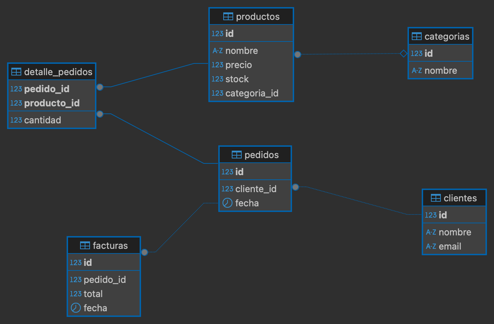

# ☕ Coffee Shop DB

Este repositorio contiene la configuración y estructura de la base de datos para una tienda online de café. Utilicé **PostgreSQL en un contenedor Docker** para facilitar el despliegue y trabajé con herramientas como **Git, GitHub, Docker, PostgreSQL y DBeaver**.

---

## Estructura del Repositorio

- `docker-compose.yml`: Configuración de PostgreSQL en Docker.
- `estructura_coffeeshop.sql`: Script SQL con la estructura de la base de datos.
- `docs/erd_coffee_shop.png`: Diagrama Entidad-Relación (ERD) de la base de datos.
- `README.md`: Documentación del proyecto.

---

## Instalación y Configuración

### 1️⃣ **Clonación del repositorio**

```bash
git clone https://github.com/rfrancop01/coffee-shop-db.git
cd coffee-shop-db
```

### 2️⃣ **Levantando PostgreSQL con Docker**

```bash
docker-compose up -d
```

Para verificar que el contenedor está corriendo:

```bash
docker ps
```

### 3️⃣ **Conexión a PostgreSQL desde DBeaver**

Para gestionar la base de datos de forma visual, me conecté a PostgreSQL usando **DBeaver** con los siguientes datos:

   | Campo       | Valor         |
   |------------|---------------|
   | Host       | `localhost`   |
   | Puerto     | `5432`        |
   | Base de datos | `coffeeshop` |
   | Usuario    | `user`        |
   | Contraseña | `password`    |

---

## Creación de la Base de Datos

Para crear la estructura de la base de datos, ejecuté el siguiente script en DBeaver:

```sql
\i estructura_coffeeshop.sql
```

Para verificar que las tablas fueron creadas correctamente:

```sql
SELECT table_name FROM information_schema.tables WHERE table_schema = 'public';
```

---

## Modelo de Datos

Diseñé la base de datos con las siguientes entidades:

- **categorias** (id, nombre)
- **productos** (id, nombre, precio, stock, categoria_id)
- **clientes** (id, nombre, email)
- **pedidos** (id, cliente_id, fecha)
- **detalle_pedidos** (pedido_id, producto_id, cantidad)
- **facturas** (id, pedido_id, total, fecha)

**Diagrama ERD:**



---

## Control de Versiones

Mantuve el desarrollo versionado en Git, asegurándome de trabajar con ramas:

```bash
git checkout -b feature/database-setup
```

Subí los cambios al repositorio remoto:

```bash
git add .
git commit -m "feat: added database setup"
git push -u origin feature/database-setup
```

Para fusionar la rama con `main`:

```bash
git checkout main
git merge feature/database-setup
git push
```

---

## Estado del Proyecto

- [x] Configuración de PostgreSQL con Docker
- [x] Conexión con DBeaver
- [x] Creación de base de datos
- [x] Generación de ERD
- [ ] Integración con backend

---

## 📚 Recursos

- [PostgreSQL Docs](https://www.postgresql.org/docs/)
- [Docker Docs](https://docs.docker.com/)
- [DBeaver](https://dbeaver.io/)

---

## 🔗 Ricardo Franco Pérez 
Este proyecto lo desarrollé como parte de mi aprendizaje en bases de datos y herramientas de despliegue.

## 🔗 Conecta conmigo [](https://www.linkedin.com/in/ricardo-franco-p%C3%A9rez-1b036a242)


